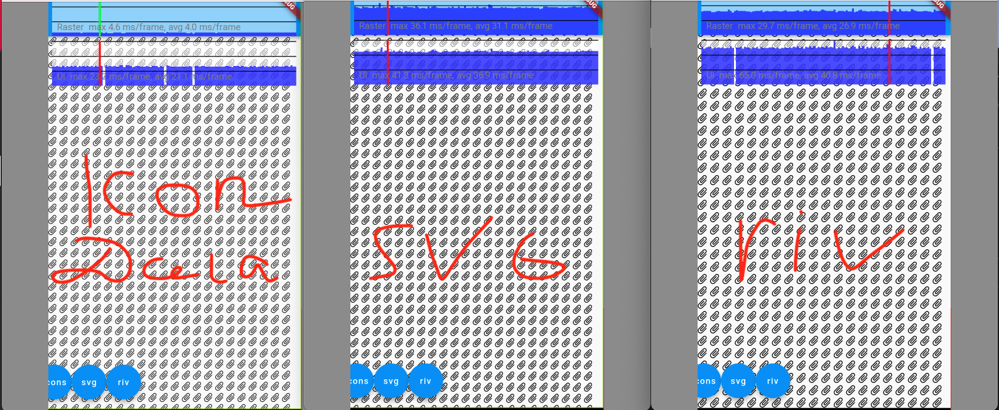

# flutter-vector-graphycs-best-practices
Лучшие практики для отрисовки векторной графики, ex. SVG

Есть разные библиотеки/способы во Flutter отрисовать svg иконку или изображение, которые тебе скинул твой дизайнер.

По первой же ссылке обычно берут flutter_svg и не парятся. И так делать не стоит.

Разберем пару кейсов.
# "Нужно отрисовать svg иконку"

Проведем эксперимент с 10к иконками на одном экране.

Использовать будем такие способы: 
- перевод svg в IconData (native way Flutter);
- отрисовка через flutter_svg library;
- перевод svg в riv формат и отрисовка by Rive library. 

Результаты такие:

Выводы: 
- отрисовывать мелкие иконки через flutter_svg - терять производительности;
- использование Rive библиотеки чуть улучшит ситуацию, но все также плохо;
- использование IconData существенно повышает производительность отрисовки иконок. Под капотом работает так, что мы переводим svg в шрифт. Конкретной иконке присвается код. Flutter отрисует такую иконку как текст. 
  
# "Нужно отрисовать тяжелую svg пикчу. И допустим еще нужно добавить интерактив (окрашивание элемментов svg по id"
Для этой задачи уже лучше использовать Rive library. Она под капотом имеет оптимизации. Четко не скажу, но кажется, что перерисовываются отдельные патчи svg (riv файла, тк нам надо сконвертировать svg в riv для работы с этой библиотекой). flutter_svg тоже позволяет рендерить и взаимодействовать с svg, как хочет разраб, но там svg перерисовывается польностью (один виджет с одним CustomPaint). 
Сравнение flutter_svg и rive. Рендер тяжелой svg схемы авто:

# "Придется ли использовать когда-нибудь flutter_svg?"
Ну кажется да, потому что rive может не отрисовать какие-то эффекты, не каждый градиент, например. И тогда придется вкорячить flutter_svg, но он тоже может что-то не отрисовать. По возможности лучше использовать rive.
